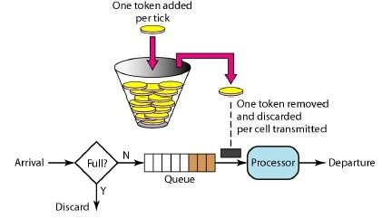

# ratelimiter
pure golang implments for token bucket


[](https://goreportcard.com/report/github.com/jhunters/ratelimiter)
[](https://github.com/jhunters/ratelimiter/actions/workflows/go.yml)
[](https://codecov.io/gh/jhunters/ratelimiter)
[](https://github.com/jhunters/ratelimiter/releases)
[](https://golang.com.cn/github.com/jhunters/ratelimiter)
[](https://github.com/jhunters/ratelimiter/blob/master/LICENSE)

## How it works

令牌桶算法(Token Bucket)和 Leaky Bucket 效果一样但方向相反的算法,更加容易理解.随着时间流逝,系统会按恒定1/QPS时间间隔(如果QPS=100,则间隔是10ms)往桶里加入Token(想象和漏洞漏水相反,有个水龙头在不断的加水),如果桶已经满了就不再加了.新请求来临时,会各自拿走一个Token,如果没有Token可拿了就阻塞或者拒绝服务.



## Usage
### Installing 

To start using ratelimiter, install Go and run `go get`:

```sh
$ go get github.com/jhunters/ratelimiter
```

### base method

create RateLimiter

```go
// 初始化令牌桶, 控制并发 100 / 秒
limiter, err := ratelimiter.NewRateLimiter(100)
if err != nil {
    panic(err)
}

```

serval ways to acquire tokens

```go
// acquire a token block unitl it reached
cost, err := limiter.Acquire()
fmt.Prinlnt(cost) // print cost time

```

```go
// acquire tokens block unitl it reached
cost, err := limiter.AcquireBatch(10)
```

```go
// try acquire tokens if ready or return false immediately
permit, err := limiter.TryAcquireBatch(20)
```

```go

// try acquire a token with time out
permit, err := limiter.TryAcquireWithTimeout(100 * time.Millisecond)

```

close RateLimiter

```go
limiter.Stop()
```